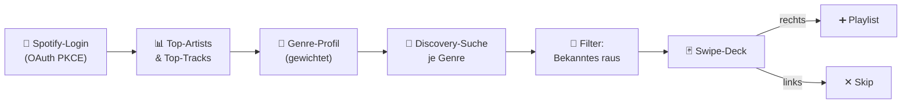

<div align="center">

# Matchify 🎧

**Musikentdeckung als Swipe-Geste.**
Wische durch Songs von Künstlern, die du noch nicht kennst — links weg, rechts direkt in die Playlist.


<!-- Screenshot/GIF einbinden, sobald vorhanden: -->
<!--  -->

</div>

---

## Das Problem

Neue Musik zu finden ist paradox anstrengend geworden. Algorithmische Radios spielen
oft dieselben zehn Künstler in Schleife, und wer bewusst Neues sucht, klickt sich
mühsam durch Suchergebnisse und „Fans mögen auch"-Listen. Erschwerend kommt hinzu:
Spotify hat 2024 seinen Recommendations-Endpoint und die Audio-Features für neue Apps
abgeschaltet — das klassische Werkzeug für „schlag mir etwas Ähnliches vor" fällt weg.

## Die Idee

Matchify überträgt die vielleicht eingängigste Interaktion der letzten zehn Jahre —
das Wischen — auf Musik. Statt Listen zu lesen, trifft man in Sekunden eine
Bauchentscheidung: Cover, Titel, kurze Vorschau, links oder rechts. Discovery wird
dadurch schnell, spielerisch und beiläufig, und am Ende steht eine Playlist, die man
nicht kuratiert, sondern *erwischt* hat. Die Vorschläge stammen dabei nicht aus einer
Blackbox, sondern werden transparent aus dem eigenen Hörverhalten abgeleitet.

## Was Matchify kann

- **Login in einem Klick** über Spotify (OAuth 2.0 mit PKCE — kein Passwort, kein Secret).
- **Persönliche Vorschläge** auf Basis der meistgehörten Künstler und Genres, ganz ohne manuelle Eingaben.
- **Nur Neues:** Künstler, die man bereits hört, und bereits bekannte Tracks werden herausgefiltert.
- **Swipe-Deck** mit Cover, 30-Sekunden-Vorschau und Passport-Stempel-Animation — bedienbar per Drag, Buttons oder Pfeiltasten.
- **Ein-Wisch-Kuration:** Ein Rechts-Swipe legt den Song direkt in einer privaten Spotify-Playlist ab.

## Wie es funktioniert

Das Herzstück ist eine kleine, nachvollziehbare Empfehlungs-Pipeline, die komplett im
Browser läuft:



1. **Geschmacksprofil.** Nach dem Login liest Matchify die meistgehörten Künstler und
   Tracks aus und leitet daraus ein **gewichtetes Genre-Profil** ab — höher gerankte
   Künstler zählen stärker.
2. **Discovery.** Für die stärksten Genres sucht Matchify gezielt nach Tracks und
   entfernt alles, was schon zum eigenen Hörkreis gehört. Übrig bleibt Musik im eigenen
   Geschmacksraum, aber von unbekannten Künstlern.
3. **Ranking & Durchmischung.** Kandidaten werden nach Genre-Gewicht (plus mildem
   Popularitäts-Bonus) sortiert und anschließend durchmischt, damit das Deck abwechslungsreich bleibt.
4. **Feedback als Datensatz.** Jeder Swipe wird als `{Merkmale, Label}` protokolliert —
   die Grundlage für das geplante lernende Ranking (siehe [Roadmap](#roadmap)).

### Tech-Stack & Design-Entscheidungen

| Bereich | Wahl | Warum |
|---|---|---|
| Frontend | Vanilla JS, eine `index.html`, kein Build | Maximale Robustheit, null Abhängigkeiten, sofort hostbar |
| Auth | OAuth 2.0 **PKCE** | Sicherer Flow für Browser-Apps — **ganz ohne Client-Secret** |
| Daten | Spotify Web API direkt via `fetch` | Keine Wrapper-Library nötig, weniger Angriffsfläche |
| Sicherheit | Access-Token nur im RAM, CSP, konsequentes Escaping | Kleine XSS-Fläche, keine persistierten Tokens |

Bewusst gibt es **kein Backend und kein Client-Secret**: Der PKCE-Flow ist genau dafür
gemacht, dass eine reine Frontend-App sicher bleibt. Nichts Geheimes kann versehentlich
ins Repository geraten, weil schlicht kein Geheimnis existiert. Ein serverseitiger Teil
kommt erst mit den Roadmap-Features hinzu — der Slot dafür ist bereits vorbereitet.

## Selbst ausprobieren

**1. Spotify-App registrieren** auf dem [Developer Dashboard](https://developer.spotify.com/dashboard) → *Create app*:
- Redirect URI exakt `http://127.0.0.1:5500/` eintragen (Spotify verlangt `127.0.0.1` statt `localhost`).
- Nur *Web API* aktivieren.
- Unter *User Management* die eigene Spotify-E-Mail freischalten (im Dev Mode erforderlich).

**2. Client ID hinterlegen:**
```bash
cp frontend/config.example.js frontend/config.js
# CLIENT_ID aus dem Dashboard in frontend/config.js eintragen
```

**3. Lokal starten:**
```bash
python3 -m http.server 5500 --directory frontend
# alternativ mit Node:  npm install && npm start
```
Anschließend `http://127.0.0.1:5500/` öffnen (mit Slash am Ende).

## Projektstruktur

```
matchify/
├── frontend/
│   ├── index.html          # die komplette App (Vanilla JS, kein Build)
│   └── config.example.js   # Vorlage → config.js (enthält die Client ID, gitignored)
├── backend/                # vorbereitet für v1 (noch nicht implementiert)
├── docs/                   # Screenshot / GIF
├── .env.example            # Vorlage fürs geplante Backend
├── package.json            # optionaler Dev-Server
└── README.md
```

## Roadmap

- **v0 — heute.** Login, genre-basierte Discovery, Swipe-UI, Playlist-Push. ✅
- **v1 — Lernendes Ranking.** Ein leichtgewichtiges Modell (logistische Regression) lernt
  live aus den Swipes und sortiert das restliche Deck neu — die Vorschläge werden mit
  jeder Entscheidung besser.
- **v1 — Bessere Ähnlichkeit.** Ein schlanker FastAPI-Dienst bindet Deezers
  `related-artists` (keyless) ein und ersetzt die reine Genre-Suche durch echte
  Künstler-Ähnlichkeit.
- **Später — Audio-Features.** BPM und Energy aus 30-Sekunden-Previews (via `librosa`),
  um über Genres hinaus nach Stimmung zu filtern.

## Einschränkungen

Matchify läuft im Spotify **Development Mode**: Das setzt ein Premium-Konto voraus und
erlaubt bis zu fünf einzeln freigeschaltete Testnutzer — ideal für Demo und
Freundeskreis, ein öffentlicher Launch ist damit bewusst nicht das Ziel. Da Spotify die
Audio-Features abgeschaltet hat, arbeitet die Discovery genre-basiert; und weil viele
Tracks keine Vorschau-URL mehr liefern, fehlt gelegentlich der 30-Sekunden-Ausschnitt —
gewischt werden kann trotzdem.

---

<div align="center">
<sub>Gebaut mit Vanilla JS und der Spotify Web API · MIT-Lizenz</sub>
</div>
